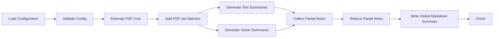

# AI Study Assistant
The AI Study Assistant is a tool designed to generate comprehensive study guides from large PDF documents. It utilizes a hierarchical Map-Reduce process to handle large documents within free tier token limits, ensuring efficient and effective processing.

## Key Features
* Processes PDF files in batches to avoid token limits
* Generates summaries using a configured model
* Reduces summaries hierarchically to create a global overview
* Supports custom instructions for tailored summaries
* Automatically saves the global overview to a Markdown file

## Directory Hierarchy
```markdown
.
├── .gitignore
├── README.md
├── poetry.lock
├── pyproject.toml
├── template_config.json
├── src
│   └── ai_study_assistant
│       ├── config.py
│       ├── estimator.py
│       ├── extractors.py
│       ├── generator.py
│       ├── main.py
│       └── notifier.py
└── summaries
```

## Module Functionality
The AI Study Assistant consists of several modules:
* `config.py`: Handles configuration loading, environment fallback, and validation of required API keys and batch settings.
* `estimator.py`: Estimates token consumption for text and visual PDF pages, prints a processing cost report, and asks the user to confirm before execution.
* `extractors.py`: Extracts text content from `.txt`, `.md`, and `.pdf` files; used for file reading and PDF text extraction.
* `generator.py`: Generates partial study notes using Groq and OpenRouter, handles multimodal and fallback routes, and reduces partial notes into a global overview.
* `main.py`: The entry point of the application; orchestrates PDF batching, routes pages to the proper model, assembles summaries, saves output, and triggers notifications.
* `notifier.py`: Sends email notifications on success or failure using the Resend API when configured.

## Prerequisites and Environment Setup
* Python 3.10 or later
* Poetry package manager
* Poppler installed on the system for `pdf2image` PDF rendering

To set up the environment:
1. Install Poetry if it is not already installed.
2. Run `poetry install` in the project root to install all dependencies from `pyproject.toml`.
3. On Windows, use `poetry shell` or activate the virtual environment with the created `Scripts\Activate` script. On macOS/Linux, use `poetry shell` or `source .venv/bin/activate` if you created a venv manually.

### Configuration
The AI Study Assistant uses a JSON configuration file to load parameters. The configuration file should contain the following parameters:
* `MODEL_NAME`: The model identifier used for summary generation (for example `llama-3.1-8b-instant`).
* `VISION_MODEL_NAME`: The model identifier used for optional visual processing, such as extracting text or context from PDF images, charts, or scanned pages.
* `REDUCE_MODEL_NAME`: The model identifier used for the hierarchical reduction step, responsible for combining batch summaries into a single global overview.
* `OPENROUTER_VISION_MODEL`: The OpenRouter vision model identifier used for visual processing requests, such as extracting text or context from PDF images, charts, or scanned pages (for example `openrouter/vision-model-name`).
* `OPENROUTER_TEXT_MODEL`: The OpenRouter text model identifier used for text-generation requests when using OpenRouter as the text backend (for example `openrouter/text-model-name`).
* `BATCH_SIZE`: The number of PDF pages processed in each batch when generating partial summaries. A smaller batch size reduces token usage per request, while a larger batch size may improve throughput.
* `MAX_VISION_PAGES`:
* `GROQ_API_KEY`: Your API key for the Groq service, required to authenticate requests to the Groq API for model access.
* `OPENROUTER_API_KEY`: Your API key for OpenRouter, required to authenticate requests when using OpenRouter text and vision models.
* `RESEND_API_KEY`: Your API key for Resend, required to send email notifications.
* `NOTIFICATION_EMAIL`: Email address to receive notifications about processing status (for example, when a process completes or if an error occurs). Leave empty or omit to disable email notifications.
* `input_path`: The path to the input PDF file
* `custom_instructions`: Optional custom instructions for the summary generation (default: empty string)

Example configuration file:
```json
{
    "MODEL_NAME": "llama-3.1-8b-instant",
    "VISION_MODEL_NAME": "qwen/qwen3.6-27b",
    "REDUCE_MODEL_NAME": "llama-3.3-70b-versatile",  
    "OPENROUTER_VISION_MODEL": "openrouter/free",
    "OPENROUTER_TEXT_MODEL": "inclusionai/ling-3.0-flash:free",
    "BATCH_SIZE": 2,
    "MAX_VISION_PAGES": 0,
    "GROQ_API_KEY": "YOUR_GROQ_API_KEY",
    "OPENROUTER_API_KEY": "YOUR_OPENROUTER_API_KEY",
    "RESEND_API_KEY": "YOUR_Resend_API_KEY",
    "NOTIFICATION_EMAIL": "notifications@example.com",
    "input_path": "path/to/input.pdf",
    "custom_instructions": "Custom instructions for the summary"
}
```

## Installation
To install the AI Study Assistant, run the following command:
```bash
poetry install
```

## Usage Example
To run the AI Study Assistant, use the following command:
```bash
poetry run study-assistant --config path/to/config.json
```
Replace `path/to/config.json` with the actual path to your configuration file.

When started, the app will ask for confirmation before continuing execution. To skip this prompt and process the PDF automatically, use the `-y` flag:

```bash
poetry run study-assistant --config path/to/config.json -y
```

This will bypass the confirmation step and immediately begin processing the PDF file.

## Usage Restrictions
* The AI Study Assistant only supports `.pdf` files; any other file type is rejected.
* `input_path` must point to an existing PDF file. It can be absolute or relative to the current working directory.
* The JSON config must include valid API key values for the selected models, such as `GROQ_API_KEY` and `OPENROUTER_API_KEY`.
* `custom_instructions` is optional and must be a plain string when provided.
* The application saves the generated summary to the `summaries/` directory in Markdown format.

## Workflow Diagram

Note: This diagram illustrates the high-level workflow of the AI Study Assistant. The actual implementation may vary depending on the specific requirements and configuration.